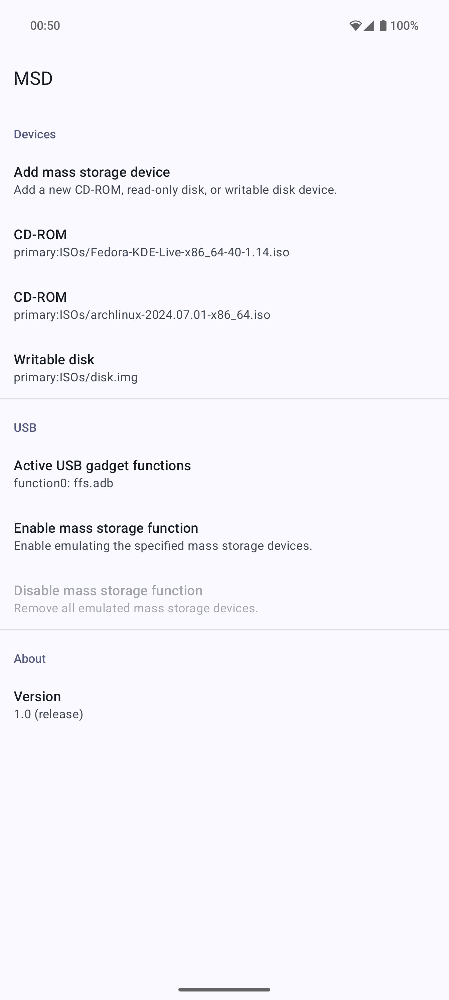
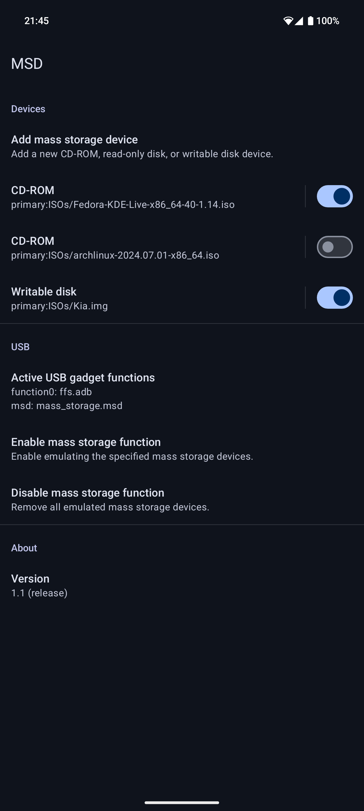

# MSD


MSD is an Android app for emulating mass storage devices over USB. It supports emulating both CD-ROM and disk devices.

MSD is installed as a Magisk/KernelSU module so that it can run with system app privileges.

 

## Features

* Supports Android 13 and newer
* Supports emulating multiple mass storage devices at the same time
  * Including mixing and matching CD-ROM and disk devices
* Does not interfere with ADB, MTP, or any other normal USB functionality

## Limitations

* The device must use configfs for configuring USB gadgets
  * To check, run `ls /config/usb_gadget/g1` as root.
* The device's kernel must be compiled with support for the mass storage USB gadget
  * To check, run `zcat /proc/config.gz | grep CONFIG_USB_CONFIGFS_MASS_STORAGE` as root.
* The device must use Android's USB gadget HAL
  * To check, run `pgrep -f android.hardware.usb.gadget-service` as root.
* Only local files are supported
  * Android's Storage Access Framework allows cloud providers to present a file as a local file using FUSE (specifically, via `StorageManager.openProxyFileDescriptor`). Unfortunately, even for the few cloud providers that support this, these files cannot be used because Android's implementation of this mechanism does not allow files to be reopened. Setting up a mass storage device requires reopening the file because the kernel has no way to accept an already open file descriptor.

## Usage

1. Download the latest version from the [releases page](https://github.com/chenxiaolong/MSD/releases). To verify the digital signature, see the [verifying digital signatures](#verifying-digital-signatures) section.

2. Install the MSD module in Magisk/KernelSU.

3. Reboot and open MSD.

4. Add one or more CD-ROM/disk images.

5. Enable the mass storage function.

6. That's it!

MSD does not need to run in the background. Once configured, the mass storage devices remain available until they're explicitly disabled or the device is rebooted.

## Permissions

The Android app part of MSD does not use any permissions at all. Also, despite that it is installed as a system app, the SELinux policy is configured so that it is not granted any more privileges than a regular user app.

The daemon part of MSD runs as the `system` user and with the `CAP_CHOWN` capability allowed. The daemon is responsible for all USB configuration. It accepts 3 requests from the app:

* Query the currently active USB gadget functions
* Set up mass storage devices from a list of file descriptors
* Query the currently active mass storage devices

When setting up mass storage devices, the daemon never opens files on its own. The app opens files itself and then sends the open file descriptor the daemon over a Unix socket. This way, even if a malicious client happened to be able to connect to the daemon, it can't expose files over mass storage devices that it didn't already have access to.

The daemon relies on SELinux for access control. If it detects certain scenarios where SELinux is not configured correctly, it will reject connections from all clients to avoid opening a security hole.

## Advanced features

### Debug mode

MSD has hidden debug options that can be enabled or disabled by long pressing the version number.

### Logs

To access the MSD's logs, enable debug mode and press `Open log directory` to open the log directory in the system file manager (DocumentsUI). Or alternatively, browse to `/sdcard/Android/com.chiller3.msd/files` manually.

* `crash.log`: Logs for the last crash.
* `/data/local/tmp/msd.post-fs-data.log`: Logs for `post-fs-data.sh` boot script.
* `/data/local/tmp/msd.service.log`: Logs for `service.sh` boot script.

To monitor the daemon's logs, run `adb logcat -v color -s msd-tool`.

When reporting bugs, please include all of the logs as they are extremely helpful for identifying what might be going wrong.

## Verifying digital signatures

Both the zip file and the APK contained within are digitally signed.

### Verifying zip file signature

To verify the digital signatures of the downloads, follow [the steps here](https://github.com/chenxiaolong/chenxiaolong/blob/master/VERIFY_SSH_SIGNATURES.md).

### Verifying apk signature

First, extract the apk from the zip and then run:

```
apksigner verify --print-certs system/priv-app/com.chiller3.msd/app-release.apk
```

Then, check that the SHA-256 digest of the APK signing certificate is:

```
de6ea74388dcff7a6120c0f192e77a92c486d40bb166c392fdf4101abc125954
```

## Building from source

### Building app and module

Make sure the [Rust toolchain](https://www.rust-lang.org/) is installed. Rust must be installed via rustup because it provides the required Android toolchains:

```bash
rustup target add aarch64-linux-android
rustup target add x86_64-linux-android
```

[cargo-android](https://github.com/chenxiaolong/cargo-android) must also be installed.

Then, MSD can be built like most other Android apps using Android Studio or the gradle command line.

To build the APK:

```bash
./gradlew assembleDebug
```

To build the Magisk/KernelSU module zip (which automatically runs the `assembleDebug` task if needed):

```bash
./gradlew zipDebug
```

The output file is written to `app/build/distributions/debug/`. The APK will be signed with the default autogenerated debug key.

To create a release build with a specific signing key, set up the following environment variables:

```bash
export RELEASE_KEYSTORE=/path/to/keystore.jks
export RELEASE_KEY_ALIAS=alias_name

read -r -s RELEASE_KEYSTORE_PASSPHRASE
read -r -s RELEASE_KEY_PASSPHRASE
export RELEASE_KEYSTORE_PASSPHRASE
export RELEASE_KEY_PASSPHRASE
```

and then build the release zip:

```bash
./gradlew zipRelease
```

## Contributing

Bug fix and translation pull requests are welcome and much appreciated!

If you are interested in implementing a new feature and would like to see it included in MSD, please open an issue to discuss it first. I intend for MSD to be as simple and low-maintenance as possible, so I am not too inclined to add new features, but I could be convinced otherwise.

## License

MSD is licensed under GPLv3. Please see [`LICENSE`](./LICENSE) for the full license text.
